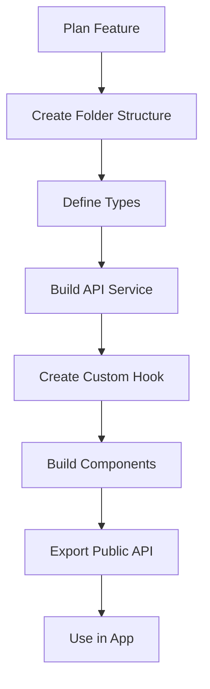

# React Project - Complete Setup Overview

## 🎉 What's Been Set Up

Your React project now has a **production-ready, scalable architecture** for building large applications with many components and subcomponents.

## 📚 Documentation Index

| Document | Purpose | When to Read |
|----------|---------|--------------|
| **PROJECT_OVERVIEW.md** (this file) | High-level overview of everything | Start here |
| **XFLOW_SDK_GUIDE.md** | Complete XFlow SDK guide | Using the PowerFlowApp API ⭐ |
| **QUICK_START.md** | Step-by-step guide to create features | When building new features |
| **ARCHITECTURE.md** | Detailed architecture explanation | Understanding the structure |
| **ARCHITECTURE_EXAMPLE.md** | Complete working example | See how it all fits together |
| **ARCHITECTURE_VISUAL.md** | Visual diagrams and flowcharts | Visual learners |
| **SERVER_SETUP.md** | EJS server & deployment | Deployment & production |
| **SETUP_SUMMARY.md** | EJS configuration summary | Environment setup |

## 🏗️ Architecture Highlights

### ✅ Feature-Based Organization
```
src/features/PowerFlow/       # Self-contained feature
  ├── components/              # UI components
  ├── hooks/                   # Business logic
  ├── services/                # API calls
  ├── types/                   # TypeScript types
  ├── utils/                   # Utilities
  └── index.ts                 # Public API
```

### ✅ Path Aliases Configured
```typescript
// Instead of ugly relative imports:
import { Button } from '../../../components/common/Button';

// Use clean path aliases:
import { Button } from '@/components/common/Button';
import { usePowerFlow } from '@/features/PowerFlow';
import { API_BASE_URL } from '@/config/api';
```

### ✅ Runtime Configuration (EJS)
- **API URL injected at runtime** - No rebuilds for different environments
- **Express server** (`server.js`) serves the app with `window.API_BASE_URL`
- **Default**: `http://localhost:8080`
- **Custom**: `API_BASE_URL=http://api.production.com npm run serve`

### ✅ TypeScript Support
- Strict type checking enabled
- Global types in `src/types/global.d.ts`
- Feature-specific types co-located

### ✅ XFlow SDK (PowerFlowApp)
- **Centralized API** for all power flow operations
- Clean interface: `PowerFlowApp.upload()`, `PowerFlowApp.solve()`
- Event system for real-time updates
- Session management built-in
- TypeScript declarations included

### ✅ Example Components
- **Button** component created as a reference
- **App_xflow_example.tsx** - Complete SDK usage example
- Shows proper structure with CSS modules
- Demonstrates TypeScript props and variants

## 📁 Complete Folder Structure

```
react-ui/
├── 📄 Configuration
│   ├── server.js              # Express + EJS server
│   ├── package.json           # Dependencies & scripts
│   ├── tsconfig.json          # TS config with path aliases
│   └── .env                   # Environment variables (gitignored)
│
├── 📚 Documentation
│   ├── PROJECT_OVERVIEW.md    # This file
│   ├── QUICK_START.md         # Getting started guide
│   ├── ARCHITECTURE.md        # Detailed architecture
│   ├── ARCHITECTURE_EXAMPLE.md # Working example
│   ├── ARCHITECTURE_VISUAL.md  # Visual diagrams
│   ├── SERVER_SETUP.md        # Server & deployment
│   └── SETUP_SUMMARY.md       # EJS setup
│
├── public/
│   ├── index.html             # Production template
│   └── index.template.ejs     # EJS template with variables
│
└── src/
    ├── features/              # ⭐ Main work area
    │   └── README.md          # Feature guidelines
    ├── components/            # Reusable components
    │   ├── common/            # Generic components
    │   │   ├── Button/        # ✓ Example component
    │   │   └── README.md      # Component guidelines
    │   ├── layout/            # Layout components
    │   └── ui/                # UI components
    ├── hooks/                 # Custom hooks
    ├── services/              # API services
    ├── config/                # Configuration
    │   └── api.ts             # ✓ API client setup
    ├── types/                 # Global types
    │   └── global.d.ts        # ✓ window.API_BASE_URL
    ├── utils/                 # Utility functions
    ├── contexts/              # React contexts
    ├── i18n/                  # ✓ Internationalization (existing)
    ├── assets/                # Static assets
    └── App.tsx                # Root component
```

## 🚀 Getting Started

### 1. Use the XFlow SDK

```javascript
import { PowerFlowApp } from '@/services/xflow';

// Initialize when app loads
await PowerFlowApp.initialize({ userId: 'demo_user' });

// Upload a file
await PowerFlowApp.upload(file);

// Solve
const results = await PowerFlowApp.solve('dc');
```

See **XFLOW_SDK_GUIDE.md** for complete documentation!

### 2. Create Your First Feature

```bash
# Create folder structure
mkdir -p src/features/MyFeature/{components,hooks,services,types,utils}

# Follow the guide in QUICK_START.md
```

### 2. Use Path Aliases

```typescript
import { Button } from '@/components/common/Button';
import { API_BASE_URL } from '@/config/api';
```

### 3. Build & Serve

```bash
# Development (hot reload, no EJS)
npm start

# Production (with EJS injection)
npm run build
npm run serve

# With custom API URL
API_BASE_URL=http://api.example.com:8080 npm run serve
```

## 🎯 Key Principles

### 1. Feature Independence
Each feature is self-contained and can work independently:
```
PowerFlow/
  ├── Everything related to power flow
  └── Exports only what others need
```

### 2. Component Composition
Build complex UIs from simple pieces:
```typescript
<Dashboard>
  <DashboardHeader />
  <DashboardContent>
    <Stats />
    <Charts />
    <Table />
  </DashboardContent>
  <DashboardFooter />
</Dashboard>
```

### 3. Custom Hooks for Logic
Extract business logic from components:
```typescript
// Component stays simple
const MyComponent = () => {
  const { data, loading, error } = useMyFeature();
  return <div>{data}</div>;
};

// Hook handles complexity
const useMyFeature = () => {
  // All the logic here
};
```

### 4. Type Safety
Use TypeScript for everything:
```typescript
interface Props {
  userId: string;
  onComplete?: (data: MyData) => void;
}

const MyComponent: React.FC<Props> = ({ userId, onComplete }) => {
  // TypeScript checks everything
};
```

### 5. Public APIs
Control what's exposed:
```typescript
// features/MyFeature/index.ts
export { MainComponent } from './components/MainComponent';
export { useMyFeature } from './hooks/useMyFeature';
export type { MyData } from './types/myFeature.types';
// Don't export internal helpers, subcomponents, etc.
```

## 🧪 Example: Complete Feature Flow

```
1. User Action
   ↓
2. Component (UI)
   - Calls custom hook
   ↓
3. Custom Hook (Logic)
   - Manages state
   - Calls API service
   ↓
4. API Service
   - Uses apiClient
   - Returns typed data
   ↓
5. Data flows back to component
   - Component renders result
```

## 📊 Scalability

This architecture scales from:
- **Small**: 10 components, 1 feature
- **Medium**: 100 components, 10 features
- **Large**: 1000+ components, 100+ features

Each feature stays organized and independent!

## 🎨 Component Size Guidelines

| Size | Lines | Structure |
|------|-------|-----------|
| **Small** | < 100 | Single file + styles |
| **Medium** | 100-300 | Add types file |
| **Large** | 300+ | Break into subcomponents + hooks |

**Rule of thumb**: If a component is getting complex, break it down!

## 🛠️ Development Workflow



1. **Plan** - What does this feature do?
2. **Structure** - Create folders
3. **Types** - Define data structures
4. **Service** - API calls
5. **Hook** - Business logic
6. **Components** - UI
7. **Export** - Public API
8. **Use** - Import in app

## 🚢 Deployment

### Development
```bash
npm start  # Hot reload, fast refresh
```

### Production
```bash
# Build
npm run build

# Serve with environment variables
PORT=3000 API_BASE_URL=http://api.production.com:8080 npm run serve
```

### Docker
```dockerfile
FROM node:18-alpine
WORKDIR /app
COPY . .
RUN npm ci --legacy-peer-deps && npm run build
EXPOSE 3000
CMD ["node", "server.js"]
```

```bash
docker run -p 3000:3000 \
  -e API_BASE_URL=http://api.production.com:8080 \
  your-image
```

## ✅ What's Working

- [x] Folder structure created
- [x] Path aliases configured (`@/components/*`, `@/features/*`, etc.)
- [x] EJS server setup with runtime API_BASE_URL injection
- [x] TypeScript configured with strict mode
- [x] Example Button component created
- [x] API client with window.API_BASE_URL
- [x] i18n setup (existing)
- [x] Build succeeds
- [x] Comprehensive documentation

## 🎯 Next Steps

### Immediate
1. **Read QUICK_START.md** - Learn how to create your first feature
2. **Review Button component** - See the example structure
3. **Check ARCHITECTURE_EXAMPLE.md** - See a complete feature

### When Building
1. **Create features in `src/features/`** - Main work area
2. **Use path aliases** - Clean imports
3. **Extract to hooks** - Keep components simple
4. **Break down large components** - Stay organized

### Before Deployment
1. **Read SERVER_SETUP.md** - Understand deployment
2. **Test with different API_BASE_URL values**
3. **Set up environment variables**

## 💡 Best Practices

### ✅ Do
- Keep features independent
- Use TypeScript types
- Break down large components
- Extract logic to hooks
- Use path aliases
- Export minimal public APIs
- Write self-documenting code

### ❌ Don't
- Import from feature internals
- Create circular dependencies
- Mix business logic with UI
- Create giant monolithic components
- Use relative imports for far paths
- Expose internal implementation details

## 🆘 Common Questions

### Q: Where do I put a new component?
**A:** 
- Generic, reusable → `components/common/`
- Feature-specific → `features/FeatureName/components/`

### Q: How do I import from another feature?
**A:** Use the feature's public API:
```typescript
// ✅ Good
import { Component } from '@/features/MyFeature';

// ❌ Bad
import { Component } from '@/features/MyFeature/components/Component';
```

### Q: My component is getting too big. What do I do?
**A:** Break it down:
1. Extract subcomponents
2. Move logic to custom hooks
3. Create utility functions

### Q: How do I make API calls?
**A:** 
1. Create API service in feature: `services/myFeatureApi.ts`
2. Use `apiClient` from `@/config/api`
3. Call from custom hook
4. Use hook in component

### Q: Where do types go?
**A:**
- Feature-specific → `features/FeatureName/types/`
- Global → `src/types/`

## 🎓 Learning Path

1. **Day 1**: Read PROJECT_OVERVIEW.md (this file) + QUICK_START.md
2. **Day 2**: Study Button component + ARCHITECTURE_EXAMPLE.md
3. **Day 3**: Create your first small feature
4. **Week 1**: Build main features following the patterns
5. **Week 2+**: Refine, optimize, and scale

## 📞 Resources

- **Quick Reference**: See QUICK_START.md
- **Deep Dive**: See ARCHITECTURE.md
- **Visual Guide**: See ARCHITECTURE_VISUAL.md
- **Working Example**: See ARCHITECTURE_EXAMPLE.md
- **Deployment**: See SERVER_SETUP.md

## 🎉 You're Ready!

Your project has:
- ✅ Scalable architecture
- ✅ Modern best practices
- ✅ TypeScript support
- ✅ Runtime configuration
- ✅ Clear organization
- ✅ Comprehensive documentation

Start building amazing features! 🚀